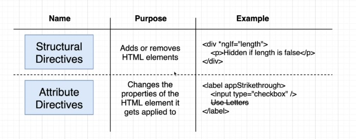
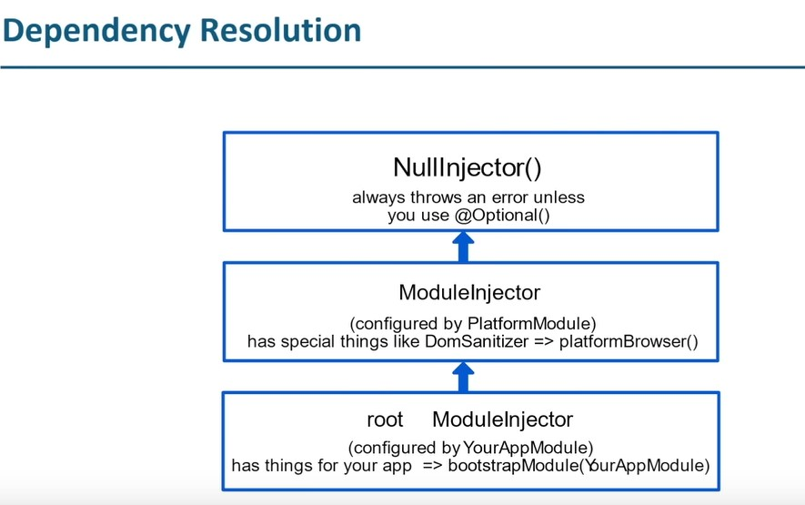
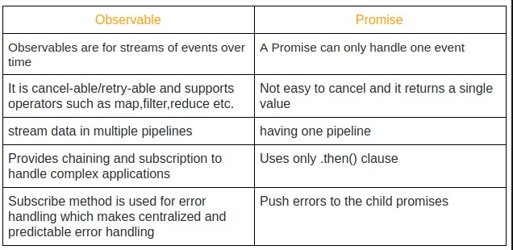

n
<style>
.heading1 {
    font-weight:700;
    font-size: 70px!important;
    margin: 0 auto;
    display: flex;
    justify-content: center;
    border-bottom: 1px solid green !important;}
.logo{
    width: 90px;
}


</style>


<h1 id="identifier" class="heading1">
    
    Angular
</h1>

- A UI component-based framework for building scalable applications.
- Provided collection of libraries to cover features like Routing and forms.

## Features of Angular
- Template
- Data binding
- Forms
- Routing
- Observable
- PWA


# Typescript
Angular uses typescript, which is javascript with types.
- Install node
- `npm init` to create a package.json
- install typescript `npm i typescript`
- initialize typescript
- `tsc --init` to create tsconfig.file.
- `tsc` to compile ts files int js.
- In the `tsconfig.ts` file uncomment the `outDir` property. it will enable to compile all ts files into the `outDir` directory.
- after enabling `outDir` property now if you compile all ts files. all those files will be stored in the `outDir` directory.

# SPA
Angular main purpose is to build SPA(single page applications) and PWA(progressive web applications).

What is SPA?
- SPA doesn't make request to server for every URL request.
- Angular has routing functionalities to create SPA.
- Angular also offers SSR(server side rendering) which supports SPA.

## Angular Installation:
- install angular cli:

    ```javascript
        npm i @angular/cli -g
    ```
    or to use `npx` to avoid having global version.

- to check angular version:
    ```javascript
    ng version
    ```

- to create a new angular workspace
    ```javascript
    ng new hotelinventory
    ```

## Introduction to mono-repo
- create and maintain multiple apps in the same repo.
- Use libraries within the project.
- Deploy multiple apps/libs from same repo
- Easy to share code within project.

## app repository introduction.
- In angular everything is class and `app.module.ts` is the root module, which will have all the information that we create.

- @NgModule: In Angular, decorators are used to add metadata to classes, properties, and methods. They provide a way to add additional behavior or modify the behavior of a class, property, or method without having to change its code. and it starts with @

- so, in app/app.module.ts file, @NgModule is a decorator

```javascript
@NgModule({
  declarations: [
    AppComponent
  ],
  imports: [
    BrowserModule,
    AppRoutingModule
  ],
  providers: [],
  bootstrap: [AppComponent]
})

```
- This @NgModule will have all the information about different components and different angular modules which is being used or any module which we have created by your own. and give all these info to compilers.

- Any component, directive and pipe needs to be registered by declarations.

```javascript
    declarations: [
    AppComponent
    ],
```

- `bootstrap: [AppComponent]`: once we compile all the files, our angular application needs to know that which component will be loaded first. so in our case it will be `AppComponent` which is in `app/app.component.ts`.

- whenever we create a component, we will get four files.
    - something.component.ts
    - something.component.html
    - something.component.scss
    - something.component.spec.ts


- Component:

```javascript
import { Component } from '@angular/core';

@Component({
  selector: 'app-root',
  template: `
    <h1>{{ title }}</h1>
  `
})
export class AppComponent {
  title = 'Hello, World!';
}
```

- In the above example, we're using the @Component decorator to define the behavior of our component. The @Component decorator takes an object literal with properties that describe the component, such as the selector and template.

The AppComponent class is decorated with the @Component decorator, which adds metadata to the class that Angular uses to create and render the component. In this example, the component has a title property and displays its value in the template.


# Template syntax
### Create a Component
Create a component: ng generate/g component/c component-name
```javascript
ng g c rooms
```


## Binding Syntax
First, what is binding?

In programming, "binding" refers to the process of connecting a value to a variable or a reference to an object, so that the variable or reference can be used to access and manipulate the value or object. This is typically done through assignment statements, where a value or reference is assigned to a variable or reference. Once a value or reference is bound to a variable or reference, the binding is said to be "fixed" or "established".

- ## Interpolation
```javascript

//rooms.components.ts
import { Component } from '@angular/core';

@Component({
  selector: 'app-rooms',
  templateUrl: './rooms.component.html',
  styleUrls: ['./rooms.component.scss']
})
export class RoomsComponent {
  hotelName: string = "Hilton hotel"
}

//rooms.component.html
<h1 class="content" role="main">
    hello world, welcome to {{hotelName}}
</h1>
```
- ## Property binding
Assignment to a property of html element.
```javascript
export class RoomsComponent {

  hotelName: string = "Hilton hotel"
  numberOfRooms: number = 50
}

//rooms.component.html
<h1 class="content" role="main">
    hello world, welcome to {{hotelName}}
</h1>


Number of Rooms
<div 
[innerText]="numberOfRooms"
>
</div>
```
- ## Event binding

Hide div

```javascript

//app.components.ts
import { Component } from '@angular/core';

@Component({
  selector: 'app-rooms',
  templateUrl: './rooms.component.html',
  styleUrls: ['./rooms.component.scss']
})
export class RoomsComponent {

  hotelName: string = "Hilton hotel"
  numberOfRooms: number = 50

  hideRooms:boolean = false;

  toggle(){
    this.hideRooms = !this.hideRooms; //toggle the value
  }
}


//rooms.components.html
<h1 class="content" role="main">
    hello world, welcome to {{hotelName}}
</h1>
    

<div [hidden]= "hideRooms">
    Number of Rooms
    <div 
    [innerText]="numberOfRooms"
    >
    </div>
</div>

<button (click)="toggle()">
    Toggle
</button>

```
<hr style="background-color: gold"/>

# Directives

## Intro
- Directives are use to change the behavior and appearance of DOM element.
- Directives can implement all lifecycle hooks.
- Directives can not have template.




## Types
### 1. Structural Directives
Structural directives are directives that shape or reshape the DOM's structure by adding, removing, and manipulating elements. They are prefixed with an asterisk (*) in the template. Examples of structural directives are `*ngIf`, `*ngFor`and `*ngSwitch`. These directives allow you to conditionally render elements or repeat them based on some conditions, making the DOM dynamic and adaptable to changing data.

#### Example: *ngFor

Imagine you have a list of books in your component class like this:
```javascript
books = [  
    { title: 'The Great Gatsby', author: 'F. Scott Fitzgerald' },  
    { title: 'To Kill a Mockingbird', author: 'Harper Lee' },  
    { title: 'The Catcher in the Rye', author: 'J.D. Salinger' }
    ];
```
You can use the ngFor directive in your HTML template to loop through the books array and display each book's title and author:

```javascript
<ul>
  <li *ngFor="let book of books">{{ book.title }} by {{ book.author }}</li>
</ul>
```

The result will be an unordered list with three list items, each displaying the title and author of a book:

```javascript
- The Great Gatsby by F. Scott Fitzgerald
- To Kill a Mockingbird by Harper Lee
- The Catcher in the Rye by J.D. Salinger
```
In this example, the ngFor directive is modifying the structure of the DOM by adding a list item for each book in the books array.

#### Example2: *ngIf
Imagine you have a boolean property `isLoggedIn` in your component class that determines whether the user is logged in or not:

```javascript
isLoggedIn = false;
```
You can use the ngIf directive in your HTML template to show or hide a welcome message based on the value of isLoggedIn:

```javascript
<div *ngIf="isLoggedIn">
  Welcome back!
</div>
```

If `isLoggedIn` is `false`, the welcome message won't be displayed. But if `isLoggedIn` is `true`, the welcome message will be displayed:

```javascript
Welcome back!
```


#### Example3: *ngSwitch

Imagine you have a string property color in your component class that holds one of several colors:

```javascript
color = 'red';
```
You can use the `ngSwitch` directive in your HTML template to display a message based on the value of `color`:

```html
<div [ngSwitch]="color">
  <div *ngSwitchCase="'red'">You have selected red</div>
  <div *ngSwitchCase="'blue'">You have selected blue</div>
  <div *ngSwitchCase="'green'">You have selected green</div>
  <div *ngSwitchDefault>Invalid color selected</div>
</div>
```

In this example, the `ngSwitch` directive is modifying the structure of the DOM by adding or removing elements based on the value of color. If `color` is 'red', the message "You have selected red" will be displayed. If `color` is not 'red', 'blue', or 'green', the message "Invalid color selected" will be displayed.


#### Note: In Angular, you can use the ternary operator to conditionally render a value in the template. The ternary operator is a shorthand for an if statement and is written as condition ? expression1 : expression2.

Here's an example of how you could use the ternary operator in Angular to display a message based on whether the user is logged in or not:


```javascript
<p>{{ isLoggedIn ? 'Welcome back!' : 'Please log in' }}</p>
```
### Difference between ternary operator and *ngIf Directive
The *ngIf directive and the ternary operator are both used to conditionally render elements in an Angular template, but they serve different purposes and have different syntax and behavior.

*ngIf is a structural directive, which means it modifies the structure of the DOM by adding or removing elements based on a condition.

The *ngIf directive is used to conditionally render an element, and the element and its content will only be displayed if the condition is true. If the condition is false, the element and its content will be removed from the DOM.

The ternary operator, on the other hand, is a shorthand for an if statement and is used to conditionally render a value in the template.


**In summary, `*ngIf` is used to conditionally render elements, and the `ternary operator` is used to conditionally render values. Both are useful for controlling the display of content based on conditions, but they have different syntax and behavior.**

### 2.  Attribute Directives
Attribute Directives are directives that add or modify the behavior and appearance of an element by adding or changing the value of its attributes. They are used to apply dynamic styles, classes, or behavior to an element based on the values of a specified property. Examples of attribute directives include `ngClass`, `ngStyle`, and `ngModel`.

#### ngClass: 
This directive allows you to dynamically bind CSS classes to an element based on the values of an expression. For example:

```html
<!-- isHighlighted is a class in the html component -->
<div [ngClass]="{'highlight': isHighlighted}"></div>
```
In this example, the class "highlight" will be added to the div element if the value of `isHighlighted` is `true`.

#### gStyle: 
This directive allows you to dynamically bind inline styles to an element based on the values of an expression. For example:

```html
<div [ngStyle]="{'background-color': backgroundColor}"></div>
```
In this example, the inline style `background-color` will be set to the value of `backgroundColor` for the div element.

#### ngModel: 
This directive is used to bind the value of an input element to a property on the component. For example:

```html
<input [(ngModel)]="name">
```

In this example, the value of the input element will be two-way bound to the name property of the component.


```javascript
<!-- In the HTML template -->
<input [(ngModel)]="name">

// In the component class
export class MyComponent {
  name: string;

  constructor() {
    this.name = '';
  }
}
```
In this example, the `input` element is bound to the `name` property of the component using the `ngModel` directive. **The square brackets [] indicate one-way binding from the component to the template, and the parentheses () indicate one-way binding from the template to the component.** Together, they form a two-way binding, so any changes to the input element will be reflected in the `name` property, and vice versa.

Here's how the example works:

When the user types into the input field, the value of the name property on the component will be updated with the new value, since the two-way binding updates the `name` property whenever the input value changes.

Conversely, if the `name` property is updated in the component (for example, as a result of an event handler), the value displayed in the input field will automatically update, since the two-way binding updates the input value whenever the `name` property changes.

<hr style="background-color: gold"/>

# Pipes

In Angular, pipes are used to transform the output of an expression before it is displayed in the template. They are a simple way to format and display data in a user-friendly way, and can be used to perform tasks such as formatting dates, currencies, percentages, and so on.

Pipes are denoted in templates using the "|" symbol, followed by the pipe name. For example:

```javascript
{{ currentDate | date }}
```

In this example, the `date` pipe is used to format the `currentDate` expression as a `date`.

Angular provides several built-in pipes, such as `date`, `currency`, `uppercase`, `lowercase`, etc. You can also create custom pipes to handle specific transformation requirements that are not covered by the built-in pipes.

Here's an example of using the currency pipe to format a value as currency:


```javascript
<!-- In the HTML template -->
Price: {{ price | currency }}

// In the component class
export class MyComponent {
  price: number;

  constructor() {
    this.price = 29.99;
  }
}
```

In this example, the `price` value is displayed as `currency` (e.g. "$29.99") in the template, thanks to the `currency` pipe. The default `currency` symbol and format is determined by the default locale of the browser, but you can also specify a custom currency code as a parameter to the pipe, like this: `{{ price | currency: 'EUR' }}` to display the value in Euro currency format.

## Built-in Pipes
This is a list of some built-in pipes:

- **async**: used to unwrap a value from an asynchronous data source.
- **date**: used to format a date value.
- **upperCase**: used to format a string value as uppercase.
- **lowerCase**: used to format a string value as lowercase.
- **titleCase**: used to format a string value as title case.
- **currency**: used to format a number as currency.
- **percent**: used to format a number as a percentage.
- **json**: used to convert a value to JSON string.
- **slice**: used to extract a part of an array or a string. the general case for slice is pagination.
- **decimal**: used to format a number as a decimal.
- **number**: used to format a number as text with a specified number of digits.


<hr style="background-color: gold"/>

# ngx-bootstrap
we will be using [`ngx-bootstrap`](https://valor-software.com/ngx-bootstrap/#/)
for styling purposes.


# Communication between parents and child components

```html
<parent-component>
  <child-component></child-component>
</parent-component>
```

The `<parent-component>` serves as the context for the `<child-component>`.

`@Input()` and `@Output()` give a child component a way to communicate with its parent component. `@Input()` lets a parent component update data in the child component. Conversely, `@Output()` lets the child send data to a parent component.
and then pass the `@Input()` property to the child component tag where it is located in the parentComponent, as a property binding.

If we start to speak in terms of `ReactJs`, `@Input` is like using `props`.

### Example: Sending data to a child component using @Input

```javascript
//parent-component: rooms.component.ts
import { Component } from '@angular/core';
import { Room, RoomList } from './rooms';

@Component({
  selector: 'app-rooms',
  templateUrl: './rooms.component.html',
  styleUrls: ['./rooms.component.scss']
})


export class RoomsComponent {

  hotelName: string = "Hilton hotel"
  numberOfRooms: number = 50

  hideRooms:boolean = false;

  rooms: Room = 
  { availableRooms: 25,
    bookedRooms: 23,
    totalRooms: 50,
  }

  toggle(){
    this.hideRooms = !this.hideRooms; //toggle the value
  }

  //roomsList data
  roomsList: RoomList[] = [...]
}


//childComponent: rooms-list.components.ts
import { Component, Input } from '@angular/core';
import { RoomList } from '../rooms';

@Component({
  selector: 'app-rooms-list',
  templateUrl: './rooms-list.component.html',
  styleUrls: ['./rooms-list.component.scss']
})
export class RoomsListComponent {

  @Input() rooms: RoomList[] = [];
}


//parentComponent: rooms.components.html
<div *ngIf="rooms.availableRooms >0 ">
    Room List:
    <app-rooms-list [rooms]="roomsList"></app-rooms-list>>
</div>
```


### Example: Sending Data Form Child to Parent Components using @Output

```javascript
//childComponent: rooms-list.components.
import { Component, EventEmitter, Input, Output } from '@angular/core';
import { RoomList } from '../rooms';

@Component({
  selector: 'app-rooms-list',
  templateUrl: './rooms-list.component.html',
  styleUrls: ['./rooms-list.component.scss']
})
export class RoomsListComponent {
  @Input() rooms: RoomList[] = [];

  @Output() selectedRoom = new EventEmitter<RoomList>();
  
  selectRoom (room: RoomList){
    this.selectedRoom.emit(room)
  }
}

//rooms-list.components.html
<table class="table">
    <tr>
        <th>Index</th>
        <th>Even/Odd</th>
        <th>Room Number</th>
        <th>Room Type</th>
        <th>Room Price</th>
        <th>Room Amenities</th>
        <th>Check-in Time</th>
        <th>Check-out Time</th>
        <th>Select Room</th>
    </tr>

    <tr
    *ngFor="let room of rooms; let e = even; let o=odd; let i= index"
    [ngClass]="e ? 'even': 'odd'">
        <td>{{i+1}}</td>
        <td>{{e}}</td>
        <td>{{room.roomNumber | number}}</td>
        <td>{{room.roomType | titlecase }}</td>
        <td>{{room.price | currency: "USD"}}</td>
        <td>{{room.amenities | lowercase}}</td>
        <td>{{room.checkInTime | date: "short"}}</td>
        <td>{{room.checkOutTime | date: "short"}}</td>
        <td>
            <button 
                type="button" 
                class="btn btn-primary"
                (click)="selectRoom(room)"
                >
                Select Room
            </button>
        </td>
    </tr>
</table>


//parentComponent: rooms.component.ts:
//add below method:
  selectRoom (room:RoomList){
    console.log(room)
  }


//rooms.component.html
<!-- Using trinary operation in Angular -->
{{rooms.availableRooms && "rooms are available" }}

<div *ngIf="rooms.availableRooms >0 ">
    Room List:
    <app-rooms-list 
    [rooms]="roomsList"
    (selectedRoom)="selectRoom($event)"
    ></app-rooms-list>
</div>

```

In the above example, the `EventEmitter` class is part of the` @angular/core` module and is used to `emit` custom events from a component or directive to its parent component. It's commonly used to pass data and trigger actions in the parent component based on events that occur in the child component.

A child component can `emit` an event by calling the `emit` method on its instance of `EventEmitter`. The parent component can listen to the event by using the `(eventName)` syntax in the template, where eventName is the name of the event to listen for. In the parent component's class, a method can be specified to handle the event when it occurs.


# Change Detection
Before I explain what change detection is, I wanted to say that in React, the equivalent of change detection is called re-rendering or updating component tree.
Change detection in Angular is the mechanism that Angular uses to detect and update the component views when the data changes. Angular provides two change detection strategies:

## Default change detection: 
Angular uses this strategy for most applications. It runs change detection for the entire component tree(from app-root to the last component) every time something changes. It's fast, efficient, and easy to understand, but can lead to performance issues for larger applications.

## OnPush change detection: 
This strategy only runs change detection for a component and its children when the component's inputs change. To use this strategy, you need to set the changeDetection property of the component's @Component decorator to `ChangeDetectionStrategy.OnPush`. This strategy is more performant than the default strategy, but requires more setup and can lead to unexpected behavior if not used correctly.

The change detection process involves checking the component's inputs and template expressions to see if they have changed. If they have, Angular updates the component's view to reflect the changes. If they haven't changed, Angular skips the component and its children.

By understanding change detection and choosing the right strategy, developers can improve the performance and scalability of their Angular applications.


### Example

let's add a button in the rooms.component.html

```javascript
<div>
    <button
    (click)="addRoom()"
    >
        add new room
    </button>
</div>
```

now add the method in the rooms.component.ts

```javascript
  addRoom(){
    const room: RoomList = 
      {
        roomNumber:10,
        roomType: "new Deluxe Room",
        amenities: "Air Conditioner, Free Wifi",
        price: 400,
        photos:"https://images.unsplash.com/photo-1615874959474-d609969a20ed?ixlib=rb-4.0.3&ixid=MnwxMjA3fDB8MHxzZWFyY2h8M3x8YmVkcm9vbXxlbnwwfHwwfHw%3D&w=1000&q=80",
        checkInTime: new Date('11-Feb-2023'),
        checkOutTime: new Date('18-Feb-2023')
      }
      
      this.roomsList.push(room);
  }
```
Now when we click on the button, new row is added.


**let's use `ChangeDetectionStrategy` to room.list.component**

```javascript
@Component({
  selector: 'app-rooms-list',
  templateUrl: './rooms-list.component.html',
  styleUrls: ['./rooms-list.component.scss'],
  changeDetection: ChangeDetectionStrategy.OnPush
})
```

and when we click on the button. it won't work (adding new room) why? It is because when we set `changeDetection: ChangeDetectionStrategy.OnPush` in the child component, while the data is coming from outside, it won't let the data get **mutated**. As we can see in the above example we were mutating the `roomsList` with `this.roomsList.push(room)`, which we shouldn't. so to solve this issue, we need to use mutating data using:

```javascript
this.roomsList = [...this.roomsList, room]
```

Now it will work, why because the we avoid mutating started working. on immutability which is supported by the child component.

<hr style="background-color: gold"/>


# Lifecycle Hooks
during the lifecycle of a component or directive. These hooks are called at specific times during the creation, update, and destruction of a component. They allow you to run custom logic or perform operations at key points in the lifecycle of a component.

Here's a list of some of the common lifecycle hooks in Angular:

1. `ngOnChanges`: called when an input or output binding value changes.
2. `ngOnInit`: called once, after the first ngOnChanges hook. 
3. `ngDoCheck`: called during every change detection cycle.
4. `ngAfterContentInit`: called after a component's content has been fully initialized.
5. `ngAfterContentChecked`: called after a component's content has been checked by Angular.
6. `ngAfterViewInit`: called after a component's view has been fully initialized.
7. `ngAfterViewChecked`: called after a component's view has been checked by Angular.
8. `ngOnDestroy`: called just before a component is destroyed.


You can implement any of these hooks in your component or directive class by defining a method with the same name as the hook. For example, you can implement the `ngOnInit` hook like this:


```javascript
import { Component, OnInit } from '@angular/core';

@Component({
  selector: 'app-my-component',
  template: `...`
})
export class MyComponent implements OnInit {
  ngOnInit() {
    // Your logic here
  }
}
```

In this example, the `MyComponent` class `implements` the `OnInit` interface and defines an `ngOnInit` method. This method will be called by Angular once, after the first ngOnChanges hook, and can be used to perform any initialization logic for the component.


Now, let's explain each of the hook:

## 1. ngOnChanges

`ngOnChanges` is a lifecycle hook in Angular that is called whenever changes are made to input properties of a component. This method is called before `ngOnInit` and is used to handle any updates or changes to the component's inputs.

The `ngOnChanges` method receives an object called `SimpleChanges` that contains the current and previous values of the changed inputs. Here's an example:

```javascript
import { Component, OnChanges, Input } from '@angular/core';

@Component({
  selector: 'app-example',
  template: `
    <p>Previous value: {{ previousValue }}</p>
    <p>Current value: {{ currentValue }}</p>
  `
})
export class ExampleComponent implements OnChanges {
  @Input() value: any;

  previousValue: any;
  currentValue: any;

  ngOnChanges(changes: SimpleChanges) {
    this.previousValue = changes.value.previousValue;//changes.['value'].previousValue
    this.currentValue = changes.value.currentValue;//changes.['value'].currentValue
  }
}
```

This example defines a component called `ExampleComponent` that `implements` the `OnChanges` lifecycle hook. The component has an Input property called `value`, which is decorated with the @Input decorator. The `value` property is a data input that can be passed to the component from its parent component.

The component template consists of two paragraphs that display the previous and current values of the value input property. The previous and current values are displayed using interpolation, which is denoted by double curly braces ({{ }}).

The `ngOnChanges` method is defined in the ExampleComponent class and receives a single argument called changes. The changes argument is of type `SimpleChanges`, which is an object that contains the current and previous values of the changed inputs.

The `ngOnChanges` method updates the previousValue and currentValue properties with the values of the value input property. The previousValue property is set to changes.value.previousValue, and the currentValue property is set to changes.value.currentValue.

The `ngOnChanges` method is called by Angular whenever changes are made to input properties of the component. This means that whenever the value of the value input property is updated, the `ngOnChanges` method will be called and the previousValue and currentValue properties will be updated with the new values. The updated values will then be displayed in the template.

#### For React Developers:
In React, there is no direct equivalent to the `ngOnChanges` lifecycle hook in Angular. However, you can achieve similar functionality in React by using the `useState` and `useEffect` hooks.

The `useState` hook is used to manage the component's state, and the `useEffect` hook is used to perform side effects in response to changes in state or props.

Here's an example of how you could implement the equivalent of ngOnChanges in React:


```javascript
import React, { useState, useEffect } from 'react';

const Example = (props) => {
  const [previousValue, setPreviousValue] = useState(props.value);
  const [currentValue, setCurrentValue] = useState(props.value);

  useEffect(() => {
    setPreviousValue(currentValue);
    setCurrentValue(props.value);
  }, [props.value]);

  return (
    <>
      <p>Previous value: {previousValue}</p>
      <p>Current value: {currentValue}</p>
    </>
  );
};
```

## 2. ngOnInit
The `ngOnInit` method is a lifecycle hook method that is defined in a component class. This method is automatically invoked by Angular after the component and its inputs have been initialized. It can be used to perform any necessary setup or configuration for the component after it has been created. This can include setting default values for component properties, setting up data bindings, or calling an API to fetch data. The goal of configuration is to get the component into a state where it is ready to display data and respond to user interactions. Configuration typically involves initializing component properties, setting up subscriptions to data sources, or performing any other setup that is required for the component to function properly.

Here is an example of how the ngOnInit method might be used to perform configuration for a component:

```javascript
import { Component, OnInit } from '@angular/core';
import { DataService } from './data.service';

@Component({
  selector: 'app-my-component',
  templateUrl: './my-component.component.html',
  styleUrls: ['./my-component.component.css']
})
export class MyComponentComponent implements OnInit {
  data: any[];

  constructor(private dataService: DataService) {}

  ngOnInit() {
    this.dataService.getData().subscribe(data => {
      this.data = data;
    });
  }
}
```

#### For React Developers:
**The concept of `ngOnInit` hook is the same concept of `useEffect` with an empty array in React.**


## 3. ngDoCheck
`ngDoCheck` is a lifecycle hook in Angular that is called during every change detection cycle. It is used to perform custom change detection, which can be useful when the Angular default change detection mechanism is not sufficient for detecting changes in your component or directive.

The `ngDoCheck` hook is called before Angular performs its own internal change detection (`ngOnChange`), and it provides a way for you to check for changes in your component and take action accordingly. For example, you might use it to compare the previous and current values of a property and perform some action if they have changed.

So, basically the difference between `ngDoCheck` and `ngOnChange` is that, `ngDoCheck` will run when whatever event is triggered/raised and it doesn't matter wherever it is located in the entire application, also it doesn't matter if the previous and current values of properties are same, it will still run. This is very costly.

However, `ngOnChange` runs only on @Input detractor, plus the previous and current values of @Input must be different, if they are same, it won't run.

Here is an example of how you could use the ngDoCheck lifecycle hook in an Angular component:

```javascript
import { Component, OnInit, DoCheck } from '@angular/core';

@Component({
  selector: 'app-example',
  template: `
    {{message}}
  `
})
export class ExampleComponent implements OnInit, DoCheck {
  message = 'Hello World';
  previousMessage = '';

  ngOnInit() {
    this.previousMessage = this.message;
  }

  ngDoCheck() {
    if (this.message !== this.previousMessage) {
      console.log('message has changed');
      this.previousMessage = this.message;
    }
  }
}
```
In this example, the `ngDoCheck` hook is used to detect changes in the message property, and it logs a message to the console if the value has changed.

#### For React Developers:
There is no alternative to `ngDoCheck` in React, because in react hooks only runs on component lifecycle.


## 4. ngAfterViewInit
Basically, `ngAfterViewInit` lifecycle hook is used to log the `child` component after it has been initialized and its view has been created.

How to access child component...

### @ViewChild
`ViewChild` is a decorator in Angular that is used to access a child component, directive or a DOM element within the parent component. This decorator allows you to access the properties and methods of the child component and manipulate them as needed.

For example, consider the following template:

```javascript
<app-child #childComponent></app-child>
```

the above line is a template for the parent component. It creates an instance of the ChildComponent and associates it with a template reference variable `#childComponent`.

A template reference variable is a reference to a DOM element or a directive within a template. In this case, the template reference variable `#childComponent` refers to an instance of the ChildComponent. This reference can then be used in the component's class to access the properties and methods of the ChildComponent instance.

You can access the ChildComponent in your parent component's class like this:

```javascript
import { Component, ViewChild } from '@angular/core';
import { ChildComponent } from './child.component';

@Component({
  selector: 'app-parent',
  template: `
    <app-child #childComponent></app-child>
  `
})

export class ParentComponent {
  @ViewChild('childComponent') child: ChildComponent;

  ngAfterViewInit() {
    console.log(this.child);
  }
}
```

the `@ViewChild` decorator is used to access the `ChildComponent` instance with the reference name `'childComponent'` and store it in the child property. The `ngAfterViewInit` lifecycle hook is used to log the child component after it has been initialized (all its methods and properties have been executed.) and its view has been created.

Another example:

```javascript
```

## 5. ngAfterViewChecked
`ngAfterViewChecked` is a lifecycle hook in Angular that is called after Angular has completed the check of a component's views and child views. This hook is called after every check of the component's views and child views, including the initial check.

This hook can be used to perform any operations that need to be done after the view has been checked and updated. For example, you can use it to trigger an update in the component's logic based on the values of the view or to check if the view has changed and react accordingly.

It is important to note that `ngAfterViewChecked` is called after every change detection cycle, so if you have any operations that are performed frequently, it is recommended to optimize them to avoid unnecessary execution.

Here is an example of how `ngAfterViewChecked` can be used in a component:


```javascript
import { AfterViewChecked, ChangeDetectorRef, Component } from '@angular/core';

@Component({
  selector: 'app-my-component',
  template: `
    <p>{{ message }}</p>
  `
})
export class MyComponent implements AfterViewChecked {
  message = 'Initial message';

  constructor(private changeDetector: ChangeDetectorRef) {}

  ngAfterViewChecked() {
    this.message = 'The view has been checked and updated';
    this.changeDetector.detectChanges();
  }
}
```

In this example, the `ngAfterViewChecked` hook is used to update the value of the message property and to trigger a change detection cycle to update the view.


## ng-template
`ng-template` is an Angular directive that is used to declare a template or a portion of HTML that can be reused across different components or parts of a component. It acts as a placeholder for content that can be dynamically loaded into the view.

The `ng-template` directive doesn't render anything on its own, instead, it is used as a container for holding content that can be rendered to the view using other Angular directives such as `ngIf`, `ngFor`, etc.


```javascript
<ng-template #myTemplate>
  <p>This is the content of my template</p>
</ng-template>

<button (click)="show = !show">Toggle Template</button>

<ng-container *ngIf="show; else myTemplate">
  <p>This text is shown when the button is clicked</p>
</ng-container>
```

In the example above, the `ng-template` directive is defined with the `#myTemplate` template reference variable, which can be used to reference the template in other parts of the component. The `ng-container` directive is then used to conditionally render the contents of the template based on the value of the show property.


what if I want to render child dynamically, rather than mentioned it in the parent template.


#### Example from our Code:
I want to load `roomsComponent` dynamically.

```html
<!-- app.component.html -->


<!-- <app-rooms></app-rooms> --> 

<!-- I want to load `roomsComponent` dynamically -->
<div>
    <ng-template #user></ng-template>
</div>

<app-demo-picker></app-demo-picker>

```

Now to access the `ng-template` the In the `app.component.ts`, we need to use `@ViewChild` to create an instance, and an object `{read: ViewContainerRef}` to dynamically load the component/directive.

```javascript
  @ViewChild('user', {read: ViewContainerRef}) vcr!: ViewContainerRef;
```
once component is accessible then we need to render the component, with creating a newComponent instance.

```javascript
import { AfterViewInit, Component, ViewChild, ViewContainerRef } from '@angular/core';
import { RoomsComponent } from './rooms/rooms.component';

@Component({
  selector: 'app-root',
  templateUrl: './app.component.html',
  styleUrls: ['./app.component.scss']
})
export class AppComponent implements AfterViewInit {
  title = 'hotelInventory';

  @ViewChild('user', {read: ViewContainerRef}) vcr!: ViewContainerRef;

  ngAfterViewInit(){
    console.log("rendering rooms")
    const componentRef = this.vcr.createComponent(RoomsComponent);
  }
}
```

and to access any of the properties or methods of the `RoomsComponent`, just use the `componentRef.instance`. for example lets access `rooms` property of the `RoomsComponent`.

```javascript
ngAfterViewInit () {
    const compRef = this.vcr.createComponent(RoomsComponent);
    compRef.instance.rooms
}
```

#### Example: Access HTML element in the Component.

```html
<h3 #date></h3>
```

```javascript
@ViewChild('date', {static: true}) date!: ElementRef;

  ngOnInit() {
    this.date.nativeElement.innerText = "Choose booking dates"
  }
```
Or Second Solution would be:

```javascript
@ViewChild('date') date!: ElementRef;

ngAfterViewInit(){
    this.date.nativeElement.innerText = "Choose booking dates"
}
```

The difference here is that: in the first solution we used, `{static: true}` which means, to resolve the reference to the DOM element during the creation of the component's view, rather than after it. This means that when Angular creates the view, it will look for an element with the attribute `#date` and assign it to the date property declared with this decorator. If the `static` option is set to false, Angular will wait until the component's view has been fully rendered and then look for the element, which could potentially result in a delay if the element is not immediately available.

By setting `static: true`, the component can be assured that the reference to the element will be available immediately, allowing it to interact with the element as soon as it is created. and we can load it in the `ngOnInit` lifecycle hook.

`static:true` most of the time has been used when you are sure that loading DOM element is not `asynchronous` meaning that it is not going to take time for initialization. and vice versa.

## ViewChildren
in case if we want to reference multiple component. It can be used to query a set of elements that are children of the current component. It returns a query list of elements, which is an observable and can be used to react to changes in the child elements.

For example, you might use @ViewChildren to get references to all of the form controls in a component's template so that you can perform some validation logic. Here's an example:

```javascript
@Component({
  selector: 'app-form',
  template: `
    <input #input1 type="text">
    <input #input2 type="text">
  `
})


export class FormComponent {
  @ViewChildren('input1, input2') inputs: QueryList<ElementRef>;
  ngAfterViewInit() {
    this.inputs.forEach(input => {
      console.log(input.nativeElement.value);
    });
  }
}
```

In this example, the `@ViewChildren` decorator is used to query for two input elements in the template, and bind the results to the `inputs` property of the component. The `ngAfterViewInit` lifecycle hook is then used to log the values of the inputs.

Note that the `#input1` and `#input2` are template references, which are used to identify the elements that you want to query.


## ngAfterContentInit

Before we jump into the `ngAfterContentInit` lifecycle hook, we need to understand what content project is.

### Content Project
Content projection, also known as `transclusion` in Angular, is a technique that allows a component to display content that is defined outside of the component. It enables you to pass content from a parent component to a child component through the component's template.

In Angular, you can project content into a component using the `ng-content` selector. The `ng-content` selector is used in the component's template to indicate where the projected content should be placed. For example:

```html
<!-- parent component template -->
<app-child>
  <h1>This is some projected content</h1>
  <p>It will be displayed inside the child component</p>
</app-child>

<!-- child component template -->
<ng-content></ng-content>
```

In this example, the content between the <app-child> tags is projected into the app-child component and is displayed where the <ng-content> selector is located. This allows you to reuse the child component and display different content within it based on the context in which it is used.

Content projection is a powerful feature in Angular that allows you to create reusable components that can be customized by the users of the components.

#### Use Multiple Component in ng-content
You can use multiple components inside of the `ng-content` element by wrapping each component in a separate element. This allows you to target specific elements with styles or logic by using the `select` attribute on the `ng-content` directive.

For example, suppose you have two components, ComponentA and ComponentB, that you want to display inside of a parent component. In the parent component's template, you can use the following syntax to include the two components:

```html
<ng-content select="app-component-a"></ng-content>
<ng-content select="app-component-b"></ng-content>
```
And in the template of the consuming component, you can use the following syntax to include the two components:

```html
<app-parent-component>
  <app-component-a></app-component-a>
  <app-component-b></app-component-b>
</app-parent-component>
```

#### use HTML tag between two components
You can include HTML content between `app-component-a` and `app-component-b` by using the `ng-content` directive without the select attribute. This will create a default content projection that will include any HTML elements that are not matched by any other `ng-content` elements with a select attribute.

```html
    <ng-content select="app-component-a"></ng-content>
    <p>This is some HTML content between app-component-a and app-component-b</p>
    <ng-content select="app-component-b"></ng-content>
```

And in the consuming component, you can include the two components as well as the HTML content as follows:

```html
<app-parent-component>
  <app-component-a></app-component-a>
  <p>This is some HTML content between app-component-a and app-component-b</p>
  <app-component-b></app-component-b>
</app-parent-component>
```

### Use an HTML tag with reference:
I want to use `#date` html reference between `app-rooms` and `app-demo-picker` components.
This only works if `#date` has been used in the `app.component.ts` file.


#### Solution1:
```html
<!-- in the parent or app.component.html -->

<app-container>
    <app-rooms></app-rooms>
    <h3 #date></h3>
    <app-demo-picker></app-demo-picker>
</app-container>
```


```html
<!-- app-container.html -->

<ng-content select="app-rooms" ></ng-content>
<ng-content></ng-content>
<ng-content select="app-demo-picker" ></ng-content>
```

#### Second solution:
To create instance of reference `#date` in the `container.component.ts` such as below:


```html
<!-- in the parent or app.component.html -->
<app-container>
    <app-rooms></app-rooms>
    <app-demo-picker></app-demo-picker>
</app-container>
```


```html
<!-- app-container.html -->

<ng-content select="app-rooms" ></ng-content>
<h3 #date></h3>
<ng-content select="app-demo-picker" ></ng-content>
```


```javascript
import { Component, ElementRef, ViewChild, OnInit } from '@angular/core';

@Component({
  selector: 'app-container',
  templateUrl: './container.component.html',
  styleUrls: ['./container.component.scss']
})
export class ContainerComponent implements OnInit {

  @ViewChild('date', {static: true}) date!: ElementRef;

  ngOnInit() {
    this.date.nativeElement.innerText = "Choose booking dates"
  }
}
```


### Intro to ngAfterContentInit:

so as we discussed above, that whatever is passed into the component (the one that has `ng-content` in its template) is considered content. for example, `app-rooms` and `app-demo-picker` are considered content.

```html
<app-container>
    <app-rooms></app-rooms>
    <app-demo-picker></app-demo-picker>
</app-container>
```


`ngAfterContentInit` is a lifecycle hook in Angular that is called after the component's content has been initialized. The hook is executed after the content of a component, which is projected into the component using the `ng-content` selector, has been checked and initialized. This hook is executed once, right after the first check of the component's content.

It is one of the several lifecycle hooks available in Angular that are called at specific moments during the lifecycle of a component. The hooks allow you to perform actions and change the behavior of a component at specific moments during its lifecycle, such as during creation, update, and destruction.

Here is an example of how `ngAfterContentInit` can be used in a component:

```html
<!-- app.component.html -->

<app-container>
    <app-rooms></app-rooms>
    <app-employee></app-employee>
    <h3 #date></h3>
    <app-demo-picker></app-demo-picker>
</app-container>
```

```html
<!-- container.component.html -->

<ng-content select="app-rooms" ></ng-content>
<ng-content select="app-employee" ></ng-content>
<ng-content ></ng-content>
<ng-content select="app-demo-picker" ></ng-content>
```

```javascript
import { EmployeeComponent } from './../employee/employee.component';
import { Component, ElementRef, ViewChild, OnInit, AfterContentInit, ContentChild } from '@angular/core';

@Component({
  selector: 'app-container',
  templateUrl: './container.component.html',
  styleUrls: ['./container.component.scss']
})


export class ContainerComponent implements  AfterContentInit {
  @ContentChild(EmployeeComponent) employee !: EmployeeComponent
  
  ngAfterContentInit(): void {
    console.log(this.employee)
    this.employee.empName = "Mike";
  }
}

```

In this example, the `ngAfterContentInit` hook change the employee name to "Mike" and then log a message to the console once the content of the component has been initialized.


## ngOnDestroy
 It is called just before an Angular component or directive is destroyed, after Angular has finished cleaning up the component and its children. This hook gives the component an opportunity to perform any final clean up work, such as releasing resources or unsubscribing from observables.

Here is an example of what ngOnDestroy might look like in a simple Angular component:


if roo.available array is not empty and hideRooms is not false. then show `rooms.list`
```html
<!-- room.components.html -->

<div *ngIf="rooms.availableRooms >0 && hideRooms ">
    Room List:
    <app-rooms-list 
    [rooms]="roomsList"
    [title]="roomsTitle"
    (selectedRoom)="selectParentRoom($event)"
    ></app-rooms-list>
</div>
```

now destroy the `roomsList` component when the above logic is false.


```javascript
  ngOnDestroy() {
    console.log("On Destroy is called" )
  }
```

<hr/>

# Dependency Injection

**Dependencies:** they are services or objects needed by classes to perform some functions.

In Angular, Dependency Injection (DI) is a powerful mechanism that enables you to manage and share dependencies across components and services in a modular, maintainable, and testable way. It helps you to decouple components and services from each other, making your application more flexible and scalable.

With DI, you can inject instances of services and other objects into a component's constructor as dependencies, making them available to the component for use. which basically means, you don't have to create a service instance but rather inject them through constructor. Angular has its own DI system that automatically manages the creation and lifetime of these dependencies. This makes it easier to manage the dependencies throughout the application and reduces the coupling between components.

For example, you might have a service that provides data to multiple components, and you can use DI to make this service available to those components. When a component needs data, it can simply call a method on the injected service, and Angular will handle the creation and lifetime of the service for you.

#### Example:
Suppose you have a data service that retrieves data from an API. You want to use this data service in a component called MyComponent. Here's how you could achieve this using dependency injection in Angular:

```javascript
import { Component } from '@angular/core';
import { DataService } from './data.service';

@Component({
  selector: 'app-my-component',
  template: `
    <p>{{ data }}</p>
  `
})

export class MyComponent {
  data: any;

  constructor(private dataService: DataService) {
    this.data = this.dataService.getData();
  }
}
```

In the above code, `DataService` is injected into the `MyComponent` using the constructor. Angular will automatically create an instance of `DataService` and provide it to the component when it's instantiated. You can then use the dataService property within the component to retrieve data from the API.

By using DI in this way, you can make your components more flexible and testable, as they are decoupled from the dependencies they use. You can easily swap out the Data`Service for a different implementation if necessary, without having to modify the component.


#### Example:

Let's fetch `roomsList` from a roomService. to create a service `ng g s rooms`

```javascript
export class RoomsService {
  roomsList: RoomList[] = [...]

  getRoom (){
    return this.roomsList
  }
  constructor() { }
}
```

now let do DI?

```javascript
//rooms.component.ts

  constructor(private roomsService: RoomsService){}

  ngOnInit(){
    this.roomsList = this.roomsService.getRoom()
  }
```

### Note:
In Angular, the difference between initializing a property inside the `constructor` and inside the `ngOnInit` lifecycle hook lies in when the initialization takes place during the component's lifecycle.

The constructor is a method that is called when a component is instantiated. When using DI, you can use the constructor to receive dependencies that are injected into the component. When initializing properties inside the constructor, they are set as soon as the component is created, and they are available for use throughout the component's lifetime.

The ngOnInit lifecycle hook, on the other hand, is a method that is called after the component's constructor and after the component's view has been initialized. This means that any properties that are set inside ngOnInit are guaranteed to have their bindings set, and the component's view will be fully rendered. This makes ngOnInit a good place to perform any initialization that requires the component's bindings or the component's view to be set up.

In conclusion, if you want to initialize a property as soon as the component is created, it's best to do so inside the constructor. If you need to perform initialization that requires the component's view or bindings to be set up, it's best to do so inside ngOnInit.


## DI Providers
DI providers are a way of registering a dependency that can be injected into components and services. A provider is essentially a configuration object that tells Angular how to create an instance of a dependency when it's needed. Providers are the way to register a dependency with the Angular DI system.

There are two types of providers in Angular:

1. Class Providers
2. Value Providers
3. Factory Providers


You can register providers at different levels of your application, from the component level to the module level. This allows you to control the scope of the dependency and manage its lifetime in a modular and maintainable way.

For example, you might register a data service as a provider in a module and make it available throughout the module. Or you might register a provider at the component level and make the dependency only available to that component and its children.

By using DI providers, you can manage the dependencies used by your components in a flexible and scalable way, making it easier to maintain and test your application.


### 1. Class providers: 
These are providers that are based on a class. To use a class provider, you simply create an instance of the class and register it as a provider. Angular will then use the class constructor to create an instance of the class whenever it's needed.

#### Example: Singleton Instance used in the Provider.

Suppose you have a data service that retrieves data from an API. Here's the code for the data service:

```javascript
import { Injectable } from '@angular/core';

@Injectable({
  providedIn: 'root'
})

export class DataService {
  getData() {
    // code to retrieve data from an API
  }
}
```
In the code above, the `DataService` is decorated with the `@Injectable` decorator, which makes it possible to use the class as a provider. The `providedIn` property on the `@Injectable `decorator is set to `'root'`, which means that the service will be available throughout the entire application, and only one instance will be available as it will be using `singleton instances design pattern.`

Next, you can use the `DataService` in a component:

```javascript
import { Component } from '@angular/core';
import { DataService } from './data.service';

@Component({
  selector: 'app-my-component',
  template: `
    <p>{{ data }}</p>
  `
})
export class MyComponent {
  data: any;

  constructor(private dataService: DataService) {
    this.data = this.dataService.getData();
  }
}
```
In the code above, the `DataService` is injected into the MyComponent using the `constructor`. Angular will automatically create an instance of the `DataService` class and provide it to the component when it's instantiated.

This is an example of how you can use class providers in Angular to manage the dependencies used by your components. By registering a class as a provider, you can create instances of the class whenever they're needed, making it easier to maintain and test your application.


#### Example: Same service another instance by different component.

If we don't use Dependency Injection using constructor of a class, and instead we use `providers:[DataService]` 

```javascript
@Component({
  selector: 'app-my-component',
  template: `
    <p>{{ data }}</p>
  `,
  providers: [DataService]

})
export class MySecondComponent {
  data: any;

  constructor(private dataService: DataService) {
    this.data = this.dataService.getData();
  }
}
```

we are actually creating another instance. one that is registered in the `root` of the application and the second instance that is registered in `MySecondComponent`. and we Don't use this most often.


### 2. Value providers: 
These are providers that are based on a value. To use a value provider, you simply provide a value and register it as a provider. Angular will then return the same value whenever it's needed. value providers are a way to provide a constant value as a dependency for a component or a service. The value is specified at the time of configuration and remains unchanged throughout the lifecycle of the application.

#### Example1: 
```javascript
import { Injectable } from '@angular/core';

@Injectable({
  providedIn: 'root',
  useValue: 'Hello World!'
})
export class MyService {
  constructor(public message: string) {}
}
```

In this example, the `MyService` class is marked as a provider using the `@Injectable` decorator, and its scope is defined as the `root` of the application using the `providedIn` property. The value `"Hello World!"` is provided using the useValue property.

In a component that needs an instance of MyService, the string constant can be accessed as a property of the MyService instance:

Here's an example of using a value provider to supply a string constant as a dependency:
```javascript
import { Component } from '@angular/core';
import { MyService } from './my.service';

@Component({
  selector: 'app-root',
  template: `
    <div>{{ myService.message }}</div>
  `
})
export class AppComponent {
  constructor(public myService: MyService) {}
}
```

In this example, the `AppComponent` class injects an instance of `MyService` using its constructor. The value of the message property can then be accessed using `myService.message`.

Value providers are a simple and straightforward way to provide constant values as dependencies in an Angular application. They can be used to provide configuration values, constants, or any other values that don't change during the lifetime of the application.

#### Example2:
Let's a more common example such as not importing apiNodes in each module or component.

```javascript
//environment.ts
export const environment = {
    production: false,
    apiEndpoint: 'http://localhost:8080/api/v1/',
}
```

Use the above `apiEndpoint` in `AppConfig`

```javascript
import { InjectionToken } from "@angular/core";
import { AppConfig } from "./app.config.interface";
import {environment} from "../../environments/environment"

export const APP_SERVICE_CONFIG = new InjectionToken<AppConfig> ("app.config")
export const APP_CONFIG:AppConfig = {
    apiEndpoint: environment.apiEndpoint
}
```
Now, the service and value is ready. let's register it in the `app.component.ts` file.

```javascript
@NgModule({
providers: [
    {
        provide: APP_SERVICE_CONFIG,
        useValue: APP_CONFIG
    }
]
})
```

Now, let's use the provider, in the room service:

```javascript
import { AppConfig } from './../../AppConfig/app.config.interface';
import { APP_SERVICE_CONFIG } from './../../AppConfig/app.config.service';
import { Inject, Injectable } from '@angular/core';
import { RoomList } from '../rooms';

@Injectable({
  providedIn: 'root'
})

export class RoomsService {
  constructor(@Inject (APP_SERVICE_CONFIG) private config:AppConfig )  {
    console.log("room service initialized...")
    }
}
```
As you can see, we have used `@Inject` decorator: which is used to specify a dependency to be injected into the constructor of a class. In this case, the token "APP_SERVICE_CONFIG" is used to identify the provider that should be injected. It will be passed as an argument to the constructor. 


#### Example3: using localStorage as a value provider

Before we go through an example. let's understand what is `InjectionToken`:

##### InjectionToken:
`InjectionToken` is a class in Angular that allows you to define a unique identifier that can be used to inject dependencies into your application. Unlike using a string token, using an InjectionToken ensures that the dependency injection system can differentiate between different tokens with the same string value.

Example: In this example, we create an InjectionToken called API_BASE_URL and provide it with a string value of `'https://example.com/api'`. We use the provide option to associate this token with a provider, which in this case uses the useValue option to provide a constant value for the token.

```javascript
import { InjectionToken } from '@angular/core';
export const API_BASE_URL = new InjectionToken<string>('API_BASE_URL');

@NgModule({
  providers: [
    { provide: API_BASE_URL, useValue: 'https://example.com/api' }
  ]
})
export class AppModule { }
```

##### Example: using useValue Provider:

```javascript
//localStorage.token.ts

import { InjectionToken } from '@angular/core';

export const  localStorageToken = new InjectionToken<any> ("local storage", {
    providedIn: "root",
    factory() { //nothing but return a new instance of localStorage.
        return localStorage
    },
})
```

now let's inject it using these codes:

```javascript
//app.component.ts

  constructor(@Inject (localStorageToken) private localStorage: any ){}
    ngOnInit() {
    this.localStorage.setItem('name', "Hilton Hotel")
  }
```


### 3. Factory Function Providers:
#### useFactory:
`useFactory` is an Angular provider configuration option that allows you to define a factory function (a function that returns an object or a value that can be used as a dependency in your application) for creating a provider instance. The `useFactory` option is typically used when you need to perform some additional configuration or setup on a provider before it is injected into your application.

The `useFactory` option can also be used to create a provider instance based on some external configuration or environment variables. Here's an example:


```javascript
import { InjectionToken } from '@angular/core';

export const API_URL = new InjectionToken<string>('API_URL');
export function apiBaseUrlFactory() {
  return 'https://example.com/api';
}

@NgModule({
  providers: [
    { provide: API_URL, useFactory: apiBaseUrlFactory }
  ]
})
export class AppModule { }
```

In this example, we create an `InjectionToken` called `API_URL`, which represents the base URL for our API. We then create a factory function called `apiBaseUrlFactory` that returns the string `'https://example.com/api'`. We use the `useFactory` option to provide the `API_URL` token with this factory function. When the `API_URL` token is injected into a component or service, the factory function will be called to create the provider instance.


## Dependency Resolution
Dependency resolution is the process of finding and instantiating dependencies that are required by a component or service. The Angular DI system is responsible for resolving dependencies and providing them to the components and services that need them.

The Angular DI system uses a hierarchical approach to resolve dependencies. When you register a provider, you can specify the scope of the provider by registering it at different levels of your application, such as at the component level, the module level, or the application level.

When a component or service needs a dependency, Angular will first look for a provider at the closest level to the component. If a provider is not found at that level, Angular will look for a provider at the next higher level, and so on, until it reaches the root of the application. If a provider is not found at any level, Angular will throw an error.

The process of resolving dependencies and creating instances of dependencies is done at runtime, which means that the Angular DI system is highly dynamic and flexible. You can add, remove, or change dependencies at any time, and the Angular DI system will automatically adjust to the changes.





Here's an example of how dependency resolution works in Angular:

#### Example:
Suppose you have a data service that retrieves data from an API, and you have a component that needs to use the data service. You register the data service as a provider in the module that contains the component:

```javascript
import { NgModule } from '@angular/core';
import { DataService } from './data.service';
import { MyComponent } from './my.component';

@NgModule({
  providers: [DataService],
  declarations: [MyComponent]
})
export class MyModule { }
```

In the code above, the DataService is registered as a provider in the MyModule, which means that the service will be available to any component declared in the module.

Next, you can use the DataService in the MyComponent:

```javascript
import { Component } from '@angular/core';
import { DataService } from './data.service';

@Component({
  selector: 'app-my-component',
  template: `
    <p>{{ data }}</p>
  `
})
export class MyComponent {
  data: any;

  constructor(private dataService: DataService) {
    this.data = this.dataService.getData();
  }
}
```

In the code above, the `DataService` is injected into the `MyComponent` using the constructor. When the `MyComponent` is instantiated, Angular will automatically resolve the `DataService` dependency and provide an instance of the service to the component.

This is how the Angular DI system works to resolve dependencies and provide them to the components and services that need them. By using the Angular DI system, you can manage the dependencies used by your components and services in a flexible and scalable way.


## Resolution Modifiers
In Angular, there are three dependency injection (DI) resolution modifiers, which determine how Angular should resolve a dependency when it's requested. These are:

1. **@Optional:** This modifier is used to specify that a dependency is optional and should not cause an error if not found. Angular will return null if the dependency is not found.

2. **@Self:** This modifier is used to specify that Angular should only look for the dependency within the current injector, and not in any parent injectors.

3. **@SkipSelf:** This modifier is used to specify that Angular should skip the current injector and only look for the dependency in parent injectors.

Here's an example of using these DI resolution modifiers:


```javascript
import { Inject, Optional, Self } from '@angular/core';

@Injectable()
class MyService {
  constructor(@Optional() @Inject('APP_TITLE') appTitle: string,
              @Self() @Inject(MyOtherService) myOtherService: MyOtherService) {
    this.appTitle = appTitle;
    this.myOtherService = myOtherService;
  }
}
```

In this example, `@Optional() @Inject('APP_TITLE')` specifies that the `appTitle` dependency is optional and should not cause an error if not found. The `@Self() @Inject(MyOtherService)` modifier specifies that Angular should only look for the `MyOtherService` dependency within the current injector and not in any parent injectors.


# RxJS
## Introduction

Before we describe what RxJs is doing, go through a simple introduction of [Reactive Programming](./docs/README.md)
- RxJS (Reactive Extensions Library for JavaScript) is a useful library for reactive programming. The RxJS documentation uses this definition:
- Note: RxJS is a library for reactive programming using Observables, to make it easier to compose asynchronous or callback-based code
- Reactive programming is an event-based paradigm that allows us to run asynchronous sequences of events as soon as data is pushed to a consumer.


### Difference between Promise vs Observable
- A Promise emits a single event when an async activity finishes or fails.
- Promise emits a single value while Observable emits multiple values. So, while handling a HTTP request, Promise can manage a single response for the same request, but what if there are multiple responses to the same request, then we have to use Observable. Yes, Observable can handle multiple responses for the same request.
A Promise is always asynchronous, while an Observable can be either synchronous or asynchronous.-
- A promise is Not Lazy, while Observable is Lazy. The "Observable" is slow. It isn't called until we are subscribed to it.
- A Promise cannot be cancelled, An Observable can be cancelled by using the unsubscribe() method.
- An addition Observable provides many powerful operators like map, foreach, filter, reduce, retry, retryWhen etc.
- Angular uses Observables which is from RxJS instead of promises for dealing with HTTP

For simplicity you can look into this chart:



#### Promise
```javascript
const promise = new Promise((data) =>
{ data(1);
  data(2);
  data(3); })
.then(element => console.log(‘Promise ‘ + element));

//output
Promise 1
```

#### Observable

```javascript
const observable = new Observable((data) => {
data.next(1);
data.next(2);
data.next(3);
}).subscribe(element => console.log('Observable ' + element));


//output
Observable 1
Observable 2
Observable 3
```

### Why React developers don't tend to use RxJS?
React developers tend not to use observables for several reasons:

1. Familiarity: React developers are usually familiar with using state and props to manage component state and data flow, and observables are a new concept that requires additional learning and effort to understand and use effectively.

2. Complexity: Observables can be complex and challenging to implement, especially for developers who are new to functional programming concepts.

3. Integration: Observables are not tightly integrated with React and its ecosystem, so developers must use additional libraries to make them work with React.

4. Performance: Observables can lead to performance issues when not used correctly, especially in complex applications with large amounts of data.

5. Alternative solutions: There are alternative solutions such as Redux and the React context API, which are widely used and well-documented in the React community, and can solve many of the same problems that observables are used for.

In short, observables can be a powerful tool for managing data in a React application, but they also come with additional challenges and complexities. Many React developers prefer to stick with the tried and true solutions they are familiar with, rather than experimenting with new and untested technologies.

### Redux vs RxJs
`Redux` and `RxJS` are both commonly used in Angular for state management and data flow. However, they serve different purposes and have different strengths and weaknesses.

Redux is a state management library that is commonly used with Angular. It provides a centralized store for managing the state of your application, and it uses a strict unidirectional data flow to ensure that the state is updated in a predictable way. Redux also provides a way to easily write and run tests against your state updates, which can be especially useful when working with complex applications.

RxJS, on the other hand, is a library for reactive programming in JavaScript. It provides a powerful set of tools for working with observables, including a large number of operators for transforming and manipulating data. RxJS is commonly used in Angular for managing asynchronous data streams, such as network requests, user interactions, and real-time updates.

So, in general, you might use Redux for centralized state management, and RxJS for managing asynchronous data streams. That being said, the two libraries can be used together, and in some cases, it may make sense to use both to get the best of both worlds.

The choice between Redux and RxJS will depend on your specific use case and the requirements of your application. If you have a complex application with a lot of state to manage, Redux may be a good choice. If you are working with asynchronous data streams, such as user interactions or real-time updates, RxJS may be a better choice.


## HTTP request in Angular

### Introduction
- In enterprise applications we need to  interact with APIs.
- like Ajax and Fetch.
- HttpClient is service provided by Angular to interact with APIs.
- HttpClient internally uses RxJs.

### Setting up HttpClient
- Need to import `HttpClientModule`.
- Once Module is imported we can inject `HttpClient` service.

```javascript
import {HttpClientModule } from '@angular/common/http'

@NgModule({
  declarations: [
    AppComponent,
  ],
  imports: [
    BrowserModule,
    AppRoutingModule,
    HttpClientModule
  ]
})

export class AppModule { }
```

### Using HttpClient Service
- [Use this link for more details regarding proxy setup.](https://angular.io/guide/build#proxying-to-a-backend-server)
- setup `proxy.conf.json` file:
```javascript
{
    "/api": {
        "target": "http://localhost:5000",
        "secure": false
    }
}
```
- In the CLI configuration file, `angular.json`, add the `proxyConfig` option to the `serve` target

```javascript
"serve": {
          "builder": "@angular-devkit/build-angular:dev-server",
          "configurations": {
            "production": {
              "browserTarget": "hotelInventory:build:production"
            },
            "development": {
              "browserTarget": "hotelInventory:build:development",
              "proxyConfig": "src/proxy.conf.json"
            }
          },
          "defaultConfiguration": "development"
        },
```

- to fetch data using http in the constructor: `private http: HttpClient`

```javascript
  constructor(
    @Inject (APP_SERVICE_CONFIG) private config:AppConfig,
    private http: HttpClient) 
    {
    console.log(this.config.apiEndpoint)
    console.log("room service initialized...")
  }

  getHotels (){
    return this.http.get<HotelList[]>("/v1/hotels")
  }
```

### Observable and Streams

#### What is observables:
an Observable is a way of handling asynchronous data. It is a powerful and widely used feature of Angular that allows you to manage streams of data in a way that makes it easy to build, test, and maintain complex applications.

An Observable is essentially a stream of values that can change over time, and you can subscribe to this stream of values to receive notifications whenever a new value is emitted. This makes it possible to perform actions, such as updating the user interface, whenever new data is available.

Observables are often used in Angular for tasks such as making HTTP requests, handling user interactions, or managing animations. With observables, you can handle data in a declarative way, making it easier to understand and maintain the code, especially in large applications.

[You can learn more about observables here](https://rxjs.dev/guide/observable)


Example: so whoever subscribes to the stream will receive the stream data.

```javascript
import { Observable } from 'rxjs';

    stream = new Observable(hotel=>{
        hotel.next("hotel1");
        hotel.next("hotel2");
        hotel.next("hotel3");
        hotel.complete();
    })

    ngOnInit () {
    this.stream.subscribe({
      next: (value) => console.log(value),
      complete: ()=> console.log("complete"),
      error: (err) => console.log(err)
    })
  }
```

### Pull vs Push
Push and Pull are two different types of architectures used in computer systems.

In a push architecture, data is pushed from a source to its destination(s) as soon as it becomes available. For example, in a push-based email system, an email is sent as soon as it is composed and ready to be sent. In this architecture, the source is responsible for delivering the data to its destinations.

On the other hand, in a pull architecture, the destination requests data from the source as needed. For example, in a pull-based email system, the email client would periodically check the server for new email, and then retrieve any new messages. In this architecture, the destination is responsible for requesting the data it needs from the source.

Both push and pull architectures have their own advantages and disadvantages. Push architectures are simpler and more efficient, but they can result in overwhelming the recipient with too much data. Pull architectures are more flexible and scalable, but they require more coordination between the source and destination.


Pull: getData() -> addData() -> to get latest data, getData()

**RxJs** works on a push architecture: it says, once you get the data, it is a continuous stream of data. if you add new data to the stream, whoever subscribed to the stream will get the latest data, and you don't have to call the getData() function again.

Push: getData() -> continuous stream of data -> addData().

### Http methods

#### Http request using HttpClient module:
```javascript
  constructor(
    @Inject (APP_SERVICE_CONFIG) private config:AppConfig,
    private http: HttpClient) 
    {
    console.log(this.config.apiEndpoint)
    console.log("room service initialized...")
  }

  getHotels (){
    return this.http.get<HotelList[]>("/v1/hotels")
  }
```

let's fetch data:
```javascript
export class HotelsComponent implements OnInit {

  hotelsList: HotelList[] = [];
  hotelTitle: string = "";
  constructor(private RoomsService: RoomsService){}

  ngOnInit () {
    this.RoomsService.getHotels().subscribe(hotels => {
      // console.log(hotels)
      this.hotelsList = hotels;
    })
    this.hotelTitle = "Hotels List";
  }
}
```

the above http method will only give use the data we want to fetch.

#### Http request using HttpRequest:

In Angular, the `HttpClient` module provides a way to make HTTP requests. The `HttpRequest` class is a part of this module and represents an HTTP request. It's used to configure the details of an HTTP request, such as the method, headers, and body. In short, the `HttpRequest` will provide us with all http information along with the data we want to fetch.

```javascript
  constructor(
    @Inject (APP_SERVICE_CONFIG) private config:AppConfig,
    private http: HttpClient) 
    {
    console.log(this.config.apiEndpoint)
    console.log("room service initialized...")
  }

  getHotels (){
    const request = new HttpRequest (
      "GET",
      "/v1/hotels",
      {reportProgress:true}
    )
    return this.http.request(request); 
  }
```

let's fetch data:
```javascript
export class HotelsComponent implements OnInit {

  hotelsList: HotelList[] = [];
  hotelTitle: string = "";
  constructor(private RoomsService: RoomsService){}

  ngOnInit () {
    this.RoomsService.getHotels().subscribe(place => {
      console.log(place)
    })
  }
}
```
This will give us more details about the request.

#### Case: Show to users how much data is loaded:
```javascript
export class HotelsComponent implements OnInit {

  hotelsList: HotelList[] = [];
  hotelTitle: string = "";
  totalBytes: number = 0;

  constructor(private RoomsService: RoomsService){}

  ngOnInit () {
  this.RoomsService.getHotelsLoaded().subscribe(event => {
      switch (event.type) {
        case HttpEventType.Sent: {
          console.log("Request has been sent")
          break;
        }
        case HttpEventType.ResponseHeader: {
          console.log("request success")
          break
        }
        case HttpEventType.DownloadProgress: {
          this.totalBytes += event.loaded;
          break;
        }
        case HttpEventType.Response: {
          console.log(event.body)
        }
      }
    })
  }
}
```

## RxJs Operators
why we need RxJs operators? before answer the question, we need to remind ourselves that RxJs uses `observable` which is a stream of data, and that stream of data CANNOT BE MODIFIED. It can be modified only within a stream of before it is subscribed. So, to modify the data, Operators come really handy.

### ShareReply
Here's an example of how you can use the shareReplay operator in Angular to cache and share the result of an HTTP request:

```javascript
  getHotels (){
    // return this.http.get<HotelList[]>("/v1/hotels")
    return this.http.get<HotelList[]>("/v1/hotels").pipe(shareReplay(1)) // to cache http requests.
  }
```

#### Typically or manual way:  
we use `subscribe` and `unsubscribe` with observables.

```javascript
subscription !: Subscription

ngOnInit(){
  this.subscription = this.RoomsService.getHotels().subscribe(hotels => {
    this.hotelsList = hotels;
  })
}

ngOnDestroy() {
  if (this.subscription) {
    this.subscription.unsubscribe();
  }
}
```

but what if we don't want to use subscribe manually, what if there is a better way to subscribe. right!?

#### Async Pipe method:
The async pipe is a built-in pipe that can be used to handle asynchronous data in `templates`. The async pipe subscribes to an `Observable` or a `Promise` and returns the latest value it has emitted. The pipe takes care of unsubscribing from the subscription when the component is destroyed to avoid memory leaks.

Here's an example of how to use the async pipe in a template:
```html
<ng-container *ngIf="data$ | async as data">
  {{ data }}
</ng-container>
```
In this example, `data$` is an Observable that emits the data to be displayed in the template. The `async pipe` subscribes to `data$` and returns the latest value in the `data` local template variable. The `ngIf` directive is used to conditionally render the contents of the container based on whether data is truthy or falsy.

So basically, when we subscribe to data stream and if we want to leave the component, we need to unsubscribe from the subscription, and that's where we will be using async pipe. It is same as we were subscribing to redux reducers, and if we wanted to leave the page we would unsubscribe.

Here is the example:

```javascript
//services.ts

export class HotelsService {
    constructor(
        @Inject (APP_SERVICE_CONFIG) private config:AppConfig,
        private http: HttpClient) 
        {
        console.log(this.config.apiEndpoint)
        console.log("room service initialized...")
    }

    // -------------- Fetching API ------
    getHotels (){
    // return this.http.get<HotelList[]>("/v1/hotels")
    return this.http.get<HotelList[]>("/v1/hotels").pipe(shareReplay(1)) // to cache http requests.
    }
}
```

**Send data from parent to child**

```javascript
export class HotelsComponent implements OnInit, OnDestroy  {

  constructor(private HotelsService: HotelsService){}
  hotelTitle: string = "";
  totalBytes: number = 0;
  hotels$ = this.HotelsService.getHotels(); //using async pipe
}
```


```html
<div>
    <h2>{{hotelTitle}}</h2>
    <h4>Loading data from server: {{totalBytes}}</h4>
    
    <div *ngIf="hotels$ | async as hotels">
        <app-hotels-list
        [hotels] = "hotels$ |async ">
        </app-hotels-list>
    </div>
</div>
```
In the above code snippet, the `ngIf` directive is used to conditionally render the div element based on the value of the `hotels$` Observable. The `async` pipe is used in two places:

1. In the `ngIf` directive, it's used to subscribe to the `hotels$` Observable and assign its latest value to the hotels local template variable (as hotels). The `ngIf` directive then checks if hotels is truthy or falsy to determine whether to render the div element.

2. In the `[hotels]` property binding of the `app-hotels-list` component, it's used to pass the latest value of the `hotels$` Observable to the component. This ensures that the component always has access to the latest data emitted by the Observable.

Note that using the `async` pipe in this manner can lead to multiple subscriptions to the `hotels$` Observable if the component is re-created or if the `ngIf` directive switches between being truthy and falsy multiple times. To avoid this, it's generally recommended to use a mechanism such as `ngOnPush` change detection or a higher-level abstraction such as the async pipe in a service to manage the subscription to the Observable.


**Child-components:**
```javascript
export class HotelsListComponent {
  @Input () hotels: HotelList [] | null =[]
}
```

```html
<table class="table">
    <tr>
        <th>Index</th>
        <th>Hotel Name</th>
        <th>Address</th>
        <th>Distance</th>
        <th>Desc</th>
        <th>Rooms</th>
        <th>Cheapest Price</th>
        <th>Featured</th>
    </tr>

    <tr
    *ngFor="let hotel of hotels; let e = even; let o=odd;"
    [ngClass]="e? 'even' : 'odd'">
        <td>{{hotel.id | slice:0:10}}</td>
        <td>{{hotel.name | slice:0:5}}</td>
        <td>{{hotel.address | slice:0:8}}</td>
        <td>{{hotel.distance}}</td>
        <td>{{hotel.desc | slice: 0:30}}</td>
        <td>{{hotel.rooms | slice:0:1}}</td>
        <td>{{hotel.cheapestPrice}}</td>
        <td>{{hotel.featured}}</td>
        <td>
            <!-- <button 
                type="button" 
                class="btn btn-primary"
                (click)="selectRoom(hotel)"
                >
                Select Room
            </button> -->
        </td>
    </tr>
</table>
```

### Catch Error

`hotels.component.ts`
```javascript

  error$  = new Subject<string>(); 
  getError$ = this.error$.asObservable(); //
  
  hotels$ = this.HotelsService.getHotels().pipe(
    catchError( error => {
      this.error$.next(error.message);
      return of ([])
    })
  )
```
Here's how it works:

1. `error$` is a Subject from the RxJS library. A subject is both an observable and an observer, which means it can emit values and subscribe to values. This subject is used to emit error messages that occur during the HTTP request.

2. `getError$` is a read-only observable created from the `error$` subject using the `asObservable()` method. This allows external components to subscribe to error messages without being able to emit new values.
3. `hotels$` is an observable that fetches hotel data from a HotelsService using the getHotels() method. If an error occurs during the HTTP request, the catchError operator catches the error and calls a callback function.
4. The callback function emits the error message using the `error$` subject and returns an empty array using the `of()` function. 
5. The `of()` function creates an observable that emits the specified values immediately, in this case an empty array. This ensures that the observable returned by `hotels$` always emits a value, even if the HTTP request fails.

To use this service in a component, you can subscribe to the hotels$ and getError$ observables in the template using the async pipe, like this:


### Map
So, this is the first operator that we will discuss about which can modify the data. Or in other words, we use the `map()` operator provided by the `RxJS` library to transform the values emitted by an `Observable`.

#### Example
suppose we have an Observable that emits a list of numbers and we want to create a new Observable where each element is the square of the corresponding element in the original. We can do it as follows:


```javascript
import { map } from 'rxjs/operators';
import { of } from 'rxjs';

const numbers$ = of([1, 2, 3, 4, 5]);
const squaredNumbers$ = numbers$.pipe(map(numbers => numbers.map(n=> n* n)))
```

In the above code, we use the `of()` function to create an Observable that emits the list of numbers. Then we use the `map()` operator to transform the emitted values by applying a function that squares each number. Finally, we subscribe to the transformed Observable and log the emitted values.


#### Example in our case:

```javascript
  //usage of map
  lengthOfHotels$ = this.HotelsService.getHotels().pipe(
    map(hotels => hotels.length)
  )

  ngOnInit () {
  this.lengthOfHotels$.subscribe(x=> console.log(x))
  }

```

### Http Interceptors
HTTP interceptors in Angular are used to intercept outgoing HTTP requests and incoming HTTP responses from the server. They can be used to add custom headers, modify the request/response, handle errors, and more. Interceptors can be created by implementing the `HttpInterceptor` interface and registering them in the app module's providers array. They can be applied globally to all HTTP requests or to specific requests using the `HttpClient` options parameter. Interceptors can be useful for implementing authentication, caching, logging, and other cross-cutting concerns in an Angular application.

 Add a token into the header of a request

```javascript
    headers = new HttpHeaders({token: "12341234"});
    // -------------- Fetching API ------
    getHotels (){
    return this.http.get<HotelList[]>("/v1/hotels", 
    {headers: this.headers}).pipe(shareReplay(1))

    }
```


#### Add an authorization header to every outgoing HTTP request:
If we want to send a token with every request then we need to use interceptor.
To create an http interceptor component in angular: `ng g interceptor request`


Interceptor component:
```javascript
import { Injectable } from '@angular/core';
import {
  HttpRequest,
  HttpHandler,
  HttpEvent,
  HttpInterceptor
} from '@angular/common/http';
import { Observable } from 'rxjs';

@Injectable()
export class RequestInterceptor implements HttpInterceptor {
  constructor() {}
  intercept(request: HttpRequest<unknown>, next: HttpHandler): Observable<HttpEvent<unknown>> {
    return next.handle(request);
  }
}
```

Now register the request as a provider:

```javascript
  providers: [
  {
    provide: HTTP_INTERCEPTORS,
    useClass: RequestInterceptor,
    multi: true
  }
],
```
`HTTP_INTERCEPTORS` is nothing but an injectToken.

So we cannot modify our original request, we need to clone it first.

```javascript
//hotel.service.ts
  // -------------- Fetching API ------
  getHotels (){
  // return this.http.get<HotelList[]>("/v1/hotels")
  return this.http.get<HotelList[]>("/v1/hotels").pipe(shareReplay(1)) // to cache response after multiple requests.
  }


//request.interceptor.ts
import { Injectable } from '@angular/core';
import {
  HttpRequest,
  HttpHandler,
  HttpEvent,
  HttpInterceptor,
  HttpHeaders
} from '@angular/common/http';
import { Observable } from 'rxjs';

@Injectable()
export class RequestInterceptor implements HttpInterceptor {
  constructor() {}

  intercept(request: HttpRequest<unknown>, next: HttpHandler): Observable<HttpEvent<unknown>> {

    if(request.method === 'GET') {
      // Clone the request and add the authorization header
      const newRequest = request.clone({
        headers: new HttpHeaders({token: "12341234"})
      });
      return next.handle(newRequest);
    }
    return next.handle(request);
  }
}
```
The interceptor will check if the request method is `GET` it will add token to header, if the method is otherwise it will return a normal request with no interceptor.


#### Example: Add authorization token in the interceptor request
```javascript
import { Injectable } from '@angular/core';
import { HttpEvent, HttpHandler, HttpInterceptor, HttpRequest } from '@angular/common/http';
import { Observable } from 'rxjs';

@Injectable()
export class AuthInterceptor implements HttpInterceptor {
  intercept(req: HttpRequest<any>, next: HttpHandler): Observable<HttpEvent<any>> {
    // Get the auth token from local storage
    const authToken = localStorage.getItem('authToken');

    // Clone the request and add the authorization header
    const authReq = req.clone({
      headers: req.headers.set('Authorization', `Bearer ${authToken}`)
    });

    // Pass the new request to the next interceptor in the chain
    return next.handle(authReq);
  }
}
```
In this example, the `AuthInterceptor` class implements the `HttpInterceptor` interface and overrides the `intercept` method. The method receives the original HTTP request (`req`) and a reference to the next `HttpHandler` in the chain (`next`). The interceptor first retrieves the auth token from local storage, then clones the original request and adds an Authorization header with the token. Finally, it passes the new request to the next interceptor or the `HttpClient` if there are no more interceptors. To use this interceptor, you would need to register it in the app module's providers array.


### APP_INITIALIZERS
`APP_INITIALIZERS` is an Angular feature that allows you to run some code before your application starts. You can use it to initialize external services, load data from an API, or perform any other task that needs to be completed before your application is fully operational. `APP_INITIALIZERS` is a function that returns a Promise that is resolved when the initialization is complete. You can define multiple `APP_INITIALIZERS`, and they will be executed in the order they are defined.

here is a simple example:

```javascript
import { APP_INITIALIZER, NgModule } from '@angular/core';
import { HttpClientModule } from '@angular/common/http';

import { DataService } from './data.service';

function initializeData(dataService: DataService) {
  return () => dataService.loadData();
}

@NgModule({
  imports: [HttpClientModule],
  providers: [
    DataService,
    {
      provide: APP_INITIALIZER,
      useFactory: initializeData,
      deps: [DataService],
      multi: true
    }
  ]
})
export class AppModule { }
```

In this example, we define an `APP_INITIALIZER` that will load data from an external API using a `DataService`. The initializeData function takes a DataService as a parameter and returns a function that will call the `loadData` method on the `DataService`. We then add this initializer to the providers array in our `NgModule`, along with the DataService itself. When our application starts, Angular will run the initializeData function before the application is fully operational, ensuring that our data is loaded and ready to use.


#### Load config before our application loads:
- First create a service using: `ng g s init`.
- Create a json file named `config.json` and store it in the `/assets/config.json` directory.
- In the init service add method:
```javascript
import { HttpClient } from '@angular/common/http';
import { Injectable } from '@angular/core';
import { tap } from 'rxjs';

@Injectable({
  providedIn: 'root'
})
export class InitService {

  config: any
  constructor( private http:HttpClient) { }

  init() {
    return this.http.get("/assets/config.json")
    .pipe(tap((config) => (this.config = config)))
  }
}
```
- So, now we want this service to be called before our app initialization. In order to do that, let's create a `factory function` inside the `app.modules.ts` which will return `init()` method.
- After that, let's register the factory function as a provider.

```javascript
 providers: [{
    provide: APP_SERVICE_CONFIG,
    useValue: APP_CONFIG
  },
  {
    provide: HTTP_INTERCEPTORS,
    useClass: RequestInterceptor,
    multi: true
  },
  {
    provide: APP_INITIALIZER,
    useFactory: initFactory,
    deps: [InitService], //dependencies
    multi: true
  }
],
```

The "`multi`" property in this code indicates that the `APP_INITIALIZER` token can have multiple providers. When set to true, it means that if there are multiple providers for the same token, they will all be used, instead of only the last one registered being used.

Now to verify if the above configuration worked: Go to the `Network` and check `Fetch/XHR` tab in the browser and check the data loaded first, you could see this kind of example:

```javascript
config.json
hotels
```

or, you can inject it into a component, for example:

```javascript
//app.component.ts

export class AppComponent implements AfterViewInit {
  constructor(private initService: InitService){
    console.log(initService.config)
  }
}

//Output:
{
  apiVersion: "v1",
  repo: "Pods"
}
```


#### Example of a multi-provider of the same token:
Suppose we have a token called "Logger" which is used to provide a logging service. Multiple providers may want to provide their own logging implementation for this token. We can define them as follows:

```javascript
providers: [
  { provide: Logger, useClass: ConsoleLogger, multi: true },
  { provide: Logger, useClass: FileLogger, multi: true },
  { provide: Logger, useClass: RemoteLogger, multi: true }
]
```

In this example, we have three different providers that implement the `Logger` token. By setting the `multi` property to true for each provider, all three of them will be registered and can be used throughout the application.

Later, when we inject the Logger token into a component or service, we can use Angular's `@Inject` decorator to specify which provider we want to use. For example:

```javascript
constructor(@Inject(Logger) private logger: Logger) { ... }
```

<hr />


# Angular Router Basics

## Intro
- Provides functionalities to add routes.
- Developers can configure all routes at Frontend.
- Provides SPA functionality.
- Features to add nested routes.


## Setup Router
- Import `RouterModule`
- `forRoot` method allows us to add multiple routes config.
- Make sure you add: `<router-outlet></router-outlet>` in `app.component.html`
- Routes types:
  - Basic Routing or Default route - In this type of routing, a single path is defined for a component. For example, the route path '/home' could be defined for the HomeComponent.
  - Dynamic Routing - In this type of routing, the route path includes parameters that are used to dynamically generate the component. For example, the route path '/users/:id' could be defined to display the user details based on the user ID.
  - Child Routing - In this type of routing, multiple routes are defined for a single component. For example, the route path '/products' could be defined to display a list of products, and the child route path '/:id' could be defined to display the details of a specific product.
  - Lazy Loading - In this type of routing, the components are loaded only when they are needed, which helps to improve the performance of the application. For example, a separate module could be created for the admin section of the application, and the components for this section could be lazily loaded when the user navigates to the admin route.
  - Redirects - In this type of routing, a route can be configured to redirect to another route. For example, the route path '/' could be configured to redirect to '/home'.
  - Wildcard Routing - In this type of routing, a route is defined to match any URL that does not match any of the defined routes. This is typically used to display a 404 error page. For example, the route path '**' could be defined to match any URL.

- In Angular, when using anchor tag `<a></a>`, use `[routerLink]` instead of `[href]`

```html

<!-- a simple navigation bar -->
<div 
style="display: flex ; font-size: 16px; gap: 20px; border: 1px solid black; font-weight: bold; ">
    <a [routerLink]="'rooms'" 
    style="text-decoration: none;margin-left: 1rem;">
        Rooms
    </a>
    <a [href]= "'hotels'" style="text-decoration: none;">Hotels</a>
</div>


<router-outlet></router-outlet>
```

## Adding Angular Material and Navigation
- Go to [Angular Material](https://material.angular.io/guide/getting-started) and install AM.
- For Navigation bar go to [Schematics](https://material.angular.io/guide/schematics) and install **Navigation schematic**.
- Now you can find the navigation components in the  `app-nav` directory.
- Add navbar component in the app template.

```html
<!-- app.component.html -->

<app-app-nav></app-app-nav>
```

- Add anchor tag for navigation purpose and `<router-outlet></router-outlet>` for seeing respective component's contents.
```html
<mat-sidenav-container class="sidenav-container">
  <mat-sidenav #drawer class="sidenav" fixedInViewport
      [attr.role]="(isHandset$ | async) ? 'dialog' : 'navigation'"
      [mode]="(isHandset$ | async) ? 'over' : 'side'"
      [opened]="(isHandset$ | async) === false">
    <mat-toolbar>Menu</mat-toolbar>
    <mat-nav-list>
    <!-- navigation -->
      <a mat-list-item routerLink="room">Rooms</a>
      <a mat-list-item routerLink="hotels">Hotels</a>
    </mat-nav-list>
  </mat-sidenav>
  <mat-sidenav-content>
    <mat-toolbar color="primary">
      <button
        type="button"
        aria-label="Toggle sidenav"
        mat-icon-button
        (click)="drawer.toggle()"
        *ngIf="isHandset$ | async">
        <mat-icon aria-label="Side nav toggle icon">menu</mat-icon>
      </button>
      <span>hotelInventory</span>
    </mat-toolbar>
    <!-- router outlet -->
    <router-outlet></router-outlet>
  </mat-sidenav-content>
</mat-sidenav-container>
```

## Using ActivatedRoute Service
The ActivatedRoute service is a key part of the Angular framework that provides information about the current route in an Angular application. It is used to extract information from the current route, such as route parameters, query parameters, and the URL path.

Here are some of the key features of the ActivatedRoute service:

1. Route parameters: The ActivatedRoute service provides access to the route parameters, which are values extracted from the URL path. For example, if a route is defined as /product/:id, the id parameter can be accessed using the ActivatedRoute service.
```javascript
export class RoomBookingComponent implements OnInit {

  constructor(private router: ActivatedRoute) {}
  id!: number;
  ngOnInit(): void {
    this.router.params.subscribe(params => {
      this.id = params['roomId'];
      console.log(this.id)
    })
  }
```
And that's how you get params form router link. If you notice that we subscribed to the router.params:

- `this.router.params` - This accesses the params property of the `Router` service, which is an `Observable` that emits a new value whenever the route parameters change.

- `.subscribe(params => { ... })` - This `subscribes` to the Observable and executes a callback function when a new value is emitted. The params argument of the function represents the route parameters as a key-value pair object.

- `this.id = params['roomId']` - This assigns the value of the roomId parameter to a property of the component called id. The ['roomId'] syntax accesses the roomId property of the params object.,

As we have discussed before that whenever you `subscribe` to observable, then you need to call unsubscribe method as well, when destroying the component. So to avoid that, we will be using `async` which means we are not subscribing any longer.

```javascript
//room-booking.component.ts
id$ = this.router.params.pipe(map( params => params["roomId"]));

//room-booking.component.html
{{id$ | async }}
```

2. Query parameters: The ActivatedRoute service also provides access to query parameters, which are values passed in the URL query string. Query parameters are useful for filtering or sorting data.


- Route data: The ActivatedRoute service can also provide data associated with a route. This data can be used to configure a component or provide additional information to the user.

- Route snapshots: The ActivatedRoute service also provides a snapshot of the current route, which can be used to access the current URL or route parameters without subscribing to changes.


# Template Driven Forms
## Intro
In Angular, there are several types of forms that can be used to capture and validate user input:

### 1. Template-driven forms: 
These forms are based on Angular's template syntax and are primarily used for simple forms with basic validation requirements. In template-driven forms, Angular automatically generates and manages form controls based on the form's HTML template.

Here is an example of a simple login form created using the template-driven approach:

```html
<form #loginForm="ngForm" (ngSubmit)="onSubmit()">
  <div class="form-group">
    <label for="email">Email address</label>
    <input type="email" class="form-control" id="email" name="email" [(ngModel)]="user.email" required>
  </div>
  <div class="form-group">
    <label for="password">Password</label>
    <input type="password" class="form-control" id="password" name="password" [(ngModel)]="user.password" required>
  </div>
  <button type="submit" class="btn btn-primary" [disabled]="!loginForm.valid">Login</button>
</form>
```

In the example above, we define a form using the `<form> tag`, and we give it a reference name (`#loginForm`) that we can use later to access the form's data and validation state. We also bind the form's submission event to the `onSubmit()` method using the (`ngSubmit`) directive.

Then, we define two form inputs, one for the email and one for the password. We use the `ngModel` directive to bind the input value to a data model (`user.email` and `user.password`). We also set the `required` attribute to make these inputs mandatory.

Finally, we define a submit button that is disabled when the form is invalid (`[disabled]="!loginForm.valid"`).

In the component class, we define the user object used to store the form data, and the `onSubmit()` method used to handle the form submission:


```javascript
import { Component } from '@angular/core';

@Component({
  selector: 'app-login',
  templateUrl: './login.component.html',
  styleUrls: ['./login.component.css']
})
export class LoginComponent {
  user = {
    email: '',
    password: ''
  };

  onSubmit() {
    console.log(this.user);
  }
}
```

When the form is submitted, the `onSubmit()` method is called and the user object is printed to the console.

This is just a simple example, but you can use template-driven forms to create more complex forms with validation, custom validation messages, and more.

### 2. Reactive forms: 
These forms are built using the ReactiveForms module, which provides a more flexible and powerful approach to form validation. In reactive forms, developers manually define the form controls and their behaviors, and then use them to build the form.

Sure, here's an example of a reactive form in Angular:

```javascript
import { Component } from '@angular/core';
import { FormGroup, FormControl, Validators } from '@angular/forms';

@Component({
  selector: 'app-registration',
  templateUrl: './registration.component.html',
  styleUrls: ['./registration.component.css']
})
export class RegistrationComponent {
  registrationForm: FormGroup;

  constructor() {
    this.registrationForm = new FormGroup({
      name: new FormControl('', Validators.required),
      email: new FormControl('', [Validators.required, Validators.email]),
      password: new FormControl('', [Validators.required, Validators.minLength(6)]),
      confirmPassword: new FormControl('', Validators.required)
    });
  }

  onSubmit() {
    console.log(this.registrationForm.value);
  }
}
```

In the example above, we define a reactive form using the `FormGroup` and FormControl classes from the `@angular/forms module`. We create a registrationForm instance of `FormGroup` in the constructor, and we define four FormControl instances for the form fields: `name`, `email`, `password`, and `confirmPassword`.

We use the Validators class to set up validation rules for each form control. The `name` and `confirmPassword` fields are required, and the email field must be a valid email address. The password field must be at least 6 characters long.

In the template, we can bind the form controls to form inputs using the `formControlName` directive:

```html
<form [formGroup]="registrationForm" (ngSubmit)="onSubmit()">
  <div class="form-group">
    <label for="name">Name</label>
    <input type="text" class="form-control" id="name" formControlName="name">
  </div>
  <div class="form-group">
    <label for="email">Email address</label>
    <input type="email" class="form-control" id="email" formControlName="email">
  </div>
  <div class="form-group">
    <label for="password">Password</label>
    <input type="password" class="form-control" id="password" formControlName="password">
  </div>
  <div class="form-group">
    <label for="confirmPassword">Confirm Password</label>
    <input type="password" class="form-control" id="confirmPassword" formControlName="confirmPassword">
  </div>
  <button type="submit" class="btn btn-primary" [disabled]="!registrationForm.valid">Register</button>
</form>
```
In the template above, we use the `formGroup` directive to bind the form to the `registrationForm` instance, and we use the `formControlName` directive to bind each form input to the corresponding form control.

Finally, we define a submit button that is disabled when the form is invalid (`[disabled]="!registrationForm.valid"`).

When the form is submitted, the onSubmit() method is called, and we can access the form data using the value property of the `registrationForm` instance (`this.registrationForm.value`).


### 3. Model-driven forms: 
This is a less commonly used type of form that is built using the Model-Driven Forms library. This library allows developers to define form controls using a declarative syntax, and then use them to build the form.

### 4. Dynamic forms:
These are forms that are built dynamically at runtime, based on data from a server or user input. Dynamic forms can be implemented using either template-driven or reactive forms.

In summary, Angular provides various types of forms that cater to different use cases and requirements, including template-driven forms, reactive forms, model-driven forms, and dynamic forms.


## Setting up Template Form
- Import `FormsModule` to `app.module.ts`.
- In template driven forms we create forms using HTML tag.
- Good for developers who likes to have more control using HTML.
- use `ngModel` for 2 way data-binding.

We created a component `rooms-add` where we set up our template form.

```html

<div *ngIf="!isDirty;else successMessage"></div>
<ng-template #successMessage>
    <p class="alert alert-success">
        Successfully added
    </p>
</ng-template>  


<form (ngSubmit)="onSubmit()">
    <div class="form-group">
        <input 
        class="form-control"
        placeholder="Enter room number" 
        name="roomNumber" 
        type="number" 
        [(ngModel)]="room.roomNumber"
        (ngModelChange)="onDataChanged()"
        >
    </div>
    <div class="form-group">
        <input 
        placeholder="Enter room type" 
        name="roomType" 
        type="text" 
        class="form-control"
        [(ngModel)]="room.roomType"
        (ngModelChange)="onDataChanged()"
        >
    </div>
    <div class="form-group">
        <input 
        class="form-control"
        placeholder="Enter amenities" 
        name="amenities" 
        type="text" 
        [(ngModel)]="room.amenities"
        (ngModelChange)="onDataChanged()"
        >
    </div>
    <div class="form-group">
        <input 
        class="form-control"
        placeholder="Enter price" 
        name="price" 
        type="number" 
        [(ngModel)]="room.price"
        (ngModelChange)="onDataChanged()"
        >
    </div>
    <div class="form-group">
        <input 
        class="form-control"
        placeholder="Enter photos link" 
        name="photos" 
        type="text" 
        [(ngModel)]="room.photos"
        (ngModelChange)="onDataChanged()"
        >
    </div>
    <div class="form-group">
        <input 
        class="form-control"
        placeholder="Enter check-in time" 
        name="checkInTime" 
        type="date" 
        [(ngModel)]="room.checkInTime"
        (ngModelChange)="onDataChanged()"
        >
    </div>
    <div class="form-group">
        <input 
        placeholder="Enter check-out time" 
        name="checkOutTime" 
        type="date" 
        [(ngModel)]="room.checkOutTime"
        class="form-control"
        (ngModelChange)="onDataChanged()"
        >
    </div>

    <div>
        <button 
        class="btn btn-primary" 
        type="submit">
            Submit
        </button>
    </div>
</form>
```

```javascript
export class RoomsAddComponent implements OnInit {
  //Default values
  roomsList: RoomList[] = [];
  isDirty:boolean = false;
  room: RoomList ={
    roomNumber: null,
    roomType: "",
    amenities: "",
    price: null,
    photos: "",
    checkInTime: new Date(),
    checkOutTime: new Date()
  }

  ngOnInit(): void {
    this.roomsList = this.roomService.getRoom()
  }

  //Real time data change to show in the template:
  room$: Observable<RoomList> ;
  constructor(private roomService: RoomsService){
    this.room$ = new Observable(Observer => {
      Observer.next(this.room);
      Observer.complete();
    })
  }

  //Real time change data demonstrated in the console.log
  onDataChanged (){
    this.isDirty = true;
    console.log('Form data changed:', this.room);
  }

  onSubmit (){
    this.roomsList = [...this.roomsList, this.room ]
    console.log("room updated")
    console.log("Here is the updated rooms list", this.roomsList)
  }
}
```

## Validation
## Pristine, Dirty State and Reset
## Custom Directives and Custom Validation

# Advanced Routing
## Using Router Service
## Feature Module and Routing
## Nested Routing and Child Routes
## Lazy Loading
## Route Guards

